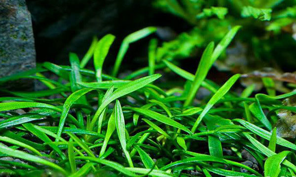

## 水缸选择

超白缸

## 灯

阳性草：灯光功率=水的体积*0.6

阴性草：灯光功率=水的体积*0.4

## 二氧化碳

阳性草需要

## 加热棒

## 底床

## 过滤

## 前景草

10cm以下，一般为密集种植的水草统称为前景草。

#### 迷你椒草

温度：25～28℃

PH  值：6.0～7.0

#### 牛毛毡

#### 矮珍珠

在合适的条件下，迷你矮珍珠会爬着地皮生长，而不是向光的方向

18-28℃

PH 值： 5.0-7.5

#### 莫丝

#### 小型椒草

#### 天胡荽

#### 针叶皇冠

#### 辣椒榕

辣椒榕对于水中微量元素的需要会较一般水草要高出不少。如果养殖辣椒榕的水体中微量元素较多的话，辣椒榕看起来就会显得比较鲜艳。辣椒榕对于二氧化碳的需求并不十分高，只要添加适量的氧气，平时再辅助以硬度较低的水质和较为强的光照，辣椒榕就会冒泡，迅速生长。

在水草造景时需要为辣椒榕选用合适的底材。水草泥虽然富含多种微量元素，但容易造成水质过酸，因而不推荐。粗砂底材与原生地环境较为相似，能够使辣椒榕保持良好生长，但不便于管理与移动，因此若选用粗砂底材则一定注意提前规划好水草造景。沉木是种植辣椒榕的最优选择，由于辣椒榕匍匐生长，所以选用一些个头比它稍大一些的沉木，另外沉木的质地较为柔软，当取下辣椒榕时不容易伤害到草体。

## 中景草

## 后景草

大水榕、水兰、波浪、铁皇冠、丝带兰、缎带椒草、红玫瑰（新叶底红）、虎耳、宫廷草、小红莓

## 生物选择

除藻：黑壳虾，大和藻虾 ，小精灵，黄金胡子，黑线飞狐，小猴飞狐

## 开缸

可以选择火山石铺地

五厘米的水草泥，后面可以稍微高

放草前 打湿水草泥。

每天灯光从四小时开始，每天加一小时，一直到8-10。观察水草涨势

两星期后加入虾。
