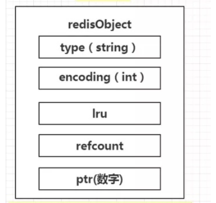

# 基本原理

## redis是什么

Redis 是典型的键值数据库。多用于缓存和消息队列。

## redis键值对模型

Redis 使用了一个哈希表来保存所有键值对，称为全局哈希表。一个哈希表，其实就是一个数组，数组的每个元素称为一个哈希桶。一个哈希表是由多个哈希桶组成的，每个哈希桶中保存了键值对数据。哈希桶中的元素保存的并不是值本身，而是指向具体值的指针。这也就是说，不管值是 String，还是集合类型，哈希桶中的元素都是指向它们的指针。

哈希表的每一项是一个 dictEntry 的结构体，用来指向一个键值对。dictEntry 结构中有三个 8 字节的指针，分别指向 key、value 以及下一个 dictEntry，三个指针共 24 字节。

### 哈希冲突

链式哈希。同一个哈希桶中的多个元素用一个链表来保存，它们之间依次用指针连接。

如果哈希表里写入的数据越来越多，哈希冲突可能也会越来越多，这就会导致某些哈希冲突链过长，进而导致这个链上的元素查找耗时长，效率降低。

### reHash 操作

增加现有的哈希桶数量，让逐渐增多的 entry 元素能在更多的桶之间分散保存，减少单个桶中的元素数量，从而减少单个桶中的冲突。

Redis 默认使用了两个全局哈希表：哈希表 1 和哈希表 2。一开始，当你刚插入数据时，默认使用哈希表 1，此时的哈希表 2 并没有被分配空间。

1. 给哈希表 2 分配更大的空间，例如是当前哈希表 1 大小的两倍；
2. 把哈希表 1 中的数据重新映射并拷贝到哈希表 2 中；
3. 释放哈希表 1 的空间。

渐进式 reHash：简单来说就是在第二步拷贝数据时，Redis 仍然正常处理客户端请求，每处理一个请求时，从哈希表 1 中的第一个索引位置开始，顺带着将这个索引位置上的所有 entries 拷贝到哈希表 2 中；等处理下一个请求时，再顺带拷贝哈希表 1 中的下一个索引位置的 entries。

## 单线程模型

### 为什么使用单线程

1. 采用多线程开发一般会引入同步原语来保护共享资源的并发访问，这也会降低系统代码的易调试性和可维护性。

2. 即使增加了线程，大部分线程也在等待获取访问共享资源的互斥锁，并行变串行，系统吞吐率并没有随着线程的增加而增加。

### 为什么单线程非常快

1. 在内存上处理数据。
2. **多路复用机制**，使其在网络 IO 操作中能并发处理大量的客户端请求，实现高吞吐率。

### 基于多路复用的高性能 I/O 模型

Linux 中的 IO 多路复用机制是指一个线程处理多个 IO 流， select/epoll 机制。此处省略。。。

## 缓冲区

# 数据结构

> ## RedisObject
>
> 因为 Redis 的数据类型有很多，而且，不同数据类型都有些相同的元数据要记录，所以，Redis 会用一个 RedisObject 结构体来统一记录这些元数据，同时指向实际数据。
>
> 
>
> type 表示当前值对象的一个数据类型
>
> enconding 表示当前值对象底层存储的编码格式
>
> lru这个字段用来记录对象最后一次访问时间
>
> refcount 记录了当前对象被引用的次数
>
> ptr 就是真实存储数据的指针。指向真实数据。
>
> 插入一条数据 set age 18，redisObject的图
>
> 
>
> 数据结构位string，编码为int，ptr存储的就是值18。此处为直接赋值。。。。。

> ## String
>
> 简单动态字符串。String类型可以保存二进制字符串。
>
> 当保存 64 位有符号整数时，String 类型会把它保存为一个 8 字节的 Long 类型整数，这种保存方式通常也叫作 int 编码方式。
>
> 当保存的数据中包含字符时，String 类型就会用简单动态字符串（Simple Dynamic String，SDS）结构体来保存
>
> - buf：字节数组，保存实际数据。为了表示字节数组的结束，Redis 会自动在数组最后加一个“\0”，这就会额外占用 1 个字节的开销。
> - len：占 4 个字节，表示 buf 的已用长度。
> - alloc：也占个 4 字节，表示 buf 的实际分配长度，一般大于 len。
>
> string类型三种编码方式：int、embstr 和 raw。
>
> 
>
> 如果是long类型的整数，RedisObject的ptr直接保存值，而不是指针。
>
> 如果字符串数据小于等于44字节，RedisObject 中的元数据、指针和 SDS 是一块连续的内存区域，这样就可以避免内存碎片。这种布局方式也被称为 embstr 编码方式。
>
> 当字符串大于 44 字节时，SDS 的数据量就开始变多了，Redis 就不再把 SDS 和 RedisObject 布局在一起了，而是会给 SDS 分配独立的空间，并用指针指向 SDS 结构。这种布局方式被称为 raw 编码模式。
>
> #### String 类型并不是万金油的解决方案，其消耗的内存较大。
>
> - 每一个string都有一个redisObject，最少8字节的额外开销(int编码)
> - 每一个string在全局哈希表中都有一个dictEntry。额外的24字节开销

> ## List
>
> #### 双向链表
>
> 平均复杂度：O(N)
>
> #### 压缩链表
>
> 类似于一个数组，数组中的每一个元素都对应保存一个数据。和数组不同的是，压缩列表在表头有三个字段 zlbytes、zltail 和 zllen，分别表示列表长度、列表尾的偏移量和列表中的 entry 个数；压缩列表在表尾还有一个 zlend，表示列表结束。
>
> 在压缩列表中，如果我们要查找定位第一个元素和最后一个元素，可以通过表头三个字段的长度直接定位，复杂度是 O(1)。而查找其他元素时，只能逐个查找，此时的复杂度就是 O(N) 。
>
> 平均复杂度：O(N)
>
> 压缩列表是一种节省内存空间的数据结构，它是用一系列连续的 entry 保存数据。每个 entry 的元数据包括下面几部分。
>
> - prev_len，表示前一个 entry 的长度。prev_len 有两种取值情况：1 字节或 5 字节。取值 1 字节时，表示上一个 entry 的长度小于 254 字节。虽然 1 字节的值能表示的数值范围是 0 到 255，但是压缩列表中 zlend 的取值默认是 255，因此，就默认用 255 表示整个压缩列表的结束，其他表示长度的地方就不能再用 255 这个值了。所以，当上一个 entry 长度小于 254 字节时，prev_len 取值为 1 字节，否则，就取值为 5 字节。
> - len：表示自身长度，4 字节；
> - encoding：表示编码方式，1 字节；
> - content：保存实际数据。
> - 这些 entry 会挨个儿放置在内存中，不需要再用额外的指针进行连接，这样就可以节省指针所占用的空间。

> ## Hash
>
> #### 哈希表
>
> 平均复杂度：O(1)
>
> #### 压缩链表
>
> 平均复杂度：O(N)
>
> ### 两种数据结构的使用情况
>
> Hash 类型设置了用压缩列表保存数据时的两个阈值，一旦超过了阈值，Hash 类型就会用哈希表来保存数据。一旦从压缩列表转为了哈希表，Hash 类型就会一直用哈希表进行保存，而不会再转回压缩列表了。
>
> - hash-max-zipList-entries：表示用压缩列表保存时哈希集合中的最大元素个数。
> - hash-max-zipList-value：表示用压缩列表保存时哈希集合中单个元素的最大长度。
>
> 为了能充分使用压缩列表的精简内存布局，我们一般要控制保存在 Hash 集合中的元素个数。
>
> #### 基于压缩链表实现的Hash如何实现单值键值对？
>
> 使用Hash类型的二级编码方法。把一个单值的数据拆分成两部分，前一部分作为 Hash 集合的 key，后一部分作为 Hash 集合的 value，这样就可以把单值数据保存到 Hash 集合中。
>
> 为了能充分使用压缩列表的精简内存布局，我们一般要控制保存在 Hash 集合中的元素个数。设置hash-max-zipList-entries的大小来保证是使用链表来存储的。

> ## sorted set
>
> #### 压缩链表
>
> #### 跳表
>
> 跳表在链表的基础上，增加了多级索引，通过索引位置的几个跳转，实现数据的快速定位。
>
> 平均复杂度：O(logN)

>  ## set
>
> #### 哈希表
>
> 平均复杂度：O(1)
>
> ####  数组
>
> 平均复杂度：O(logN)

## 其他数据类型

> ### Bitmap
>
> ### HyperLogLog
>
> ### GEO
>
> ### RedisTimeSeries
>
> ### Streams
>
> ### 自定义数据类型

# 高可用

一旦服务器宕机，内存中的数据将全部丢失。redis为了保证高可用下面两种解决方案。

## AOF日志

AOF是写后日志，“写后”的意思是 Redis 是先执行命令，把数据写入内存，然后才记录日志，所以不会阻塞当前的写操作。

AOF 进行故障恢复时，我们仍然需要把所有的操作记录都运行一遍。再加上 Redis 的单线程设计，这些命令操作只能一条一条按顺序执行效率慢。

### 三种写回策略

- Always，同步写回：每个写命令执行完，立马同步地将日志写回磁盘；
- Everysec，每秒写回：每个写命令执行完，只是先把日志写到 AOF 文件的内存缓冲区，每隔一秒把缓冲区中的内容写入磁盘；
- No，操作系统控制的写回：每个写命令执行完，只是先把日志写到 AOF 文件的内存缓冲区，由操作系统决定何时将缓冲区内容写回磁盘。

带来的问题

- 同步写回”可以做到基本不丢数据，但是它在每一个写命令后都有一个慢速的落盘操作，不可避免地会影响主线程性能；
- 虽然“操作系统控制的写回”在写完缓冲区后，就可以继续执行后续的命令，但是落盘的时机已经不在 Redis 手中了，只要 AOF 记录没有写回磁盘，一旦宕机对应的数据就丢失了；
- “每秒写回”采用一秒写回一次的频率，避免了“同步写回”的性能开销，虽然减少了对系统性能的影响，但是如果发生宕机，上一秒内未落盘的命令操作仍然会丢失。所以，这只能算是，在避免影响主线程性能和避免数据丢失两者间取了个折中。

想要获得高性能，就选择 No 策略；如果想要得到高可靠性保证，就选择 Always 策略；如果允许数据有一点丢失，又希望性能别受太大影响的话，那么就选择 Everysec 策略。

### AOF 重写机制

AOF 重写机制就是在重写时，Redis 根据数据库的现状创建一个新的 AOF 文件。把旧日志文件中的多条命令，在重写后的新日志中变成了一条命令。

例如 把a变成 1 然后变成 2 记录了两条记录，重写后只保留a=2

### bgrewriteaof

AOF 日志由主线程写回不同，重写过程是由后台子进程 bgrewriteaof 来完成的，这也是为了避免阻塞主线程，导致数据库性能下降。

每次 AOF 重写时，Redis 会先执行一个内存拷贝，用于重写；然后，使用两个日志保证在重写过程中，新写入的数据不会丢失。而且，因为 Redis 采用额外的线程进行数据重写，所以，这个过程并不会阻塞主线程。

## RDB快照

指内存中的数据在某一个时刻的状态记录。

就是把某一时刻的状态以文件的形式写到磁盘上，也就是快照。这样一来，即使宕机，快照文件也不会丢失，数据的可靠性也就得到了保证。这个快照文件就称为 RDB 文件，其中，RDB 就是 Redis DataBase 的缩写。在做数据恢复时，我们可以直接把 RDB 文件读入内存，很快地完成恢复。

Redis 的数据都在内存中，为了提供所有数据的可靠性保证，它执行的是全量快照。

Redis 提供了两个命令来生成 RDB 文件，分别是 save 和 bgsave。

- save：在主线程中执行，会导致阻塞；
- bgsave：创建一个子进程，专门用于写入 RDB 文件，避免了主线程的阻塞，这也是 Redis RDB 文件生成的默认配置。

### 写时复制技术

bgsave 子进程是由主线程 fork 生成的，可以共享主线程的所有内存数据。bgsave 子进程运行后，开始读取主线程的内存数据，并把它们写入 RDB 文件。此时，如果主线程对这些数据也都是读操作，那么，主线程和 bgsave 子进程相互不影响。但是，如果主线程要修改一块数据，那么，这块数据就会被复制一份，生成该数据的副本。然后，主线程在这个数据副本上进行修改。同时，bgsave 子进程可以继续把原来的数据写入 RDB 文件。

### 增量快照

如果频繁地执行全量快照会带来很大的性能问题。

做了一次全量快照后，后续的快照只对修改的数据进行快照记录，这样可以避免每次全量快照的开销。

### 建议方案

跟 AOF 相比，快照的恢复速度快，但是，快照的频率不好把握，如果频率太低，两次快照间一旦宕机，就可能有比较多的数据丢失。如果频率太高，又会产生额外开销。

混合使用 AOF 日志和内存快照：内存快照以一定的频率执行，在两次快照之间，使用 AOF 日志记录这期间的所有命令操作。

# 分布式(高可靠)

## 哨兵

哨兵其实就是一个运行在特殊模式下的 Redis 进程，主从库实例运行的同时，它也在运行。哨兵主要负责的就是三个任务：监控、选主（选择主库）和通知。

监控是指哨兵进程在运行时，周期性地给所有的主从库发送 PING 命令，检测它们是否仍然在线运行。如果从库没有在规定时间内响应哨兵的 PING 命令，哨兵就会把它标记为“下线状态”；同样，如果主库也没有在规定时间内响应哨兵的 PING 命令，哨兵就会判定主库下线，然后开始自动切换主库的流程。

选主。主库挂了以后，哨兵就需要从很多个从库里，按照一定的规则选择一个从库实例，把它作为新的主库。这一步完成后，现在的集群里就有了新主库。

通知。在执行通知任务时，哨兵会把新主库的连接信息发给其他从库，让它们执行 replicaof 命令，和新主库建立连接，并进行数据复制。同时，哨兵会把新主库的连接信息通知给客户端，让它们把请求操作发到新主库上。

#### 哨兵集群

多个实例组成了哨兵集群，即使有哨兵实例出现故障挂掉了，其他哨兵还能继续协作完成主从库切换的工作，包括判定主库是不是处于下线状态，选择新主库，以及通知从库和客户端。

## 主从库

Redis 提供了主从库模式，以保证数据副本的一致，主从库之间采用的是读写分离的方式。

读操作：主库、从库都可以接收；写操作：首先到主库执行，然后，主库将写操作同步给从库。

## 切片集群

切片集群，也叫分片集群，就是指启动多个 Redis 实例组成一个集群，然后按照一定的规则，把收到的数据划分成多份，每一份用一个实例来保存。

数据和实例之间如何对应呢？Redis从3.0推出Redis Cluster 方案。

#### Redis Cluster

Redis Cluster 方案采用哈希槽。一个切片集群共有 16384 个哈希槽，这些哈希槽类似于数据分区，每个键值对都会根据它的 key，被映射到一个哈希槽中。

首先根据键值对的 key，按照CRC16 算法计算一个 16 bit 的值；然后，再用这个 16bit 值对 16384 取模，得到 0~16383 范围内的模数，每个模数代表一个相应编号的哈希槽。

# 新特性

