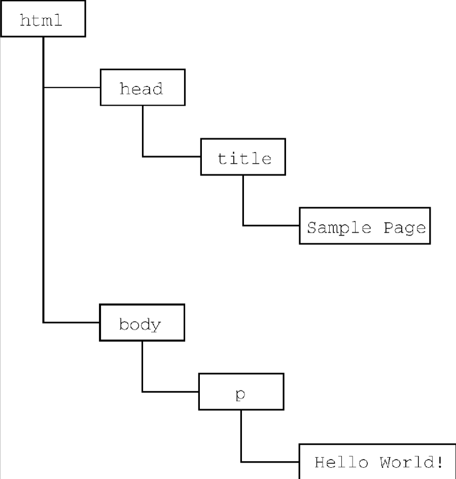

# 什么是JavaScript

1995年JavaScript问世，最初要用途是代替Perl等服务器端语言处理输入验证。起初名为Mocha，后命名为LiveScript，为了蹭Java 的热度改名为JavaScript。微软发布了IE3，其中包含自己名为JScript。1997年为了统一标准，TC39委员会推出了ECMA-262，也就是ECMAScript标准。1998年，国际标准化组织（ISO）和国际电工委员会（IEC）也将ECMAScript采纳为标准（ISO/IEC-16262）。自此以后，各家浏览器均以ECMAScript作为自己JavaScript实现的依据，虽然具体实现各有不同。

## JavaScript的实现

JavaScript包含的部分：

- 核心（ECMAScript）
- 文档对象模型（DOM）
- 浏览器对象模型（BOM）

### ECMAScript

在基本的层面，它描述这门语言的如下部分：

- 语法
- 类型
- 语句
- 关键字
- 保留字
- 操作符
- 全局对象

#### **ECMAScript符合性**

- 支持ECMA-262中描述的所有“类型、值、对象、属性、函数，以及程序语法与语义”；
- 支持Unicode字符标准。

- 增加ECMA-262中未提及的“额外的类型、值、对象、属性和函数”。ECMA-262所说的这些额外内容主要指规范中未给出的新对象或对象的新属性。
- 支持ECMA-262中没有定义的“程序和正则表达式语法”（意思是允许修改和扩展内置的正则表达式特性）。

### DOM

**文档对象模型**（DOM，Document Object Model）是一个应用编程接口（API），用于在HTML中使用扩展的XML。

DOM将整个页面抽象为一组分层节点。HTML或XML页面的每个组成部分都是一种节点，包含不同的数据。

DOM通过创建表示文档的树，让开发者可以随心所欲地控制网页的内容和结构。使用DOM API，可以轻松地删除、添加、替换、修改节点。

``` js
<html>
    <head>
        <title>Sample Page</title>
    </head>
    <body>
        <p> Hello World!</p>
    </body>
</html>
```



### BOM

IE3和Netscape Navigator 3提供了**浏览器对象模型**（BOM） API，用于支持访问和操作浏览器的窗口。使用BOM，开发者可以操控浏览器显示页面之外的部分。BOM主要针对浏览器窗口和子窗口（frame）。

- 弹出新浏览器窗口的能力；
- 移动、缩放和关闭浏览器窗口的能力；
- `navigator`对象，提供关于浏览器的详尽信息；
- `location`对象，提供浏览器加载页面的详尽信息；
- `screen`对象，提供关于用户屏幕分辨率的详尽信息；
- `performance`对象，提供浏览器内存占用、导航行为和时间统计的详尽信息；
- 对cookie的支持；
- 其他自定义对象，如`XMLHttpRequest`和IE的`ActiveXObject`。

## HTML中引入JavaScript

`<script>` 元素有下列8个属性。

- `async`：可选。表示应该立即开始下载脚本，但不能阻止其他页面动作，比如下载资源或等待其他脚本加载。只对外部脚本文件有效。

- `charset`：可选。使用`src`属性指定的代码字符集。这个属性很少使用，因为大多数浏览器不在乎它的值。

- `crossorigin`：可选。配置相关请求的CORS（跨源资源共享）设置。默认不使用CORS。`crossorigin="anonymous"`配置文件请求不必设置凭据标志。`crossorigin="use-credentials"`设置凭据标志，意味着出站请求会包含凭据。
- `defer`：可选。表示脚本可以延迟到文档完全被解析和显示之后再执行。只对外部脚本文件有效。在IE7及更早的版本中，对行内脚本也可以指定这个属性。
- `integrity`：可选。允许比对接收到的资源和指定的加密签名以验证子资源完整性（SRI，Subresource Integrity）。如果接收到的资源的签名与这个属性指定的签名不匹配，则页面会报错，脚本不会执行。这个属性可以用于确保内容分发网络（CDN，Content Delivery Network）不会提供恶意内容。
- `language`：废弃。最初用于表示代码块中的脚本语言（如`"JavaScript"`、`"JavaScript 1.2"`或`"VBScript"`）。大多数浏览器都会忽略这个属性，不应该再使用它。
- `src`：可选。表示包含要执行的代码的外部文件。使用了`src`属性的`<script>`元素不应该再在`<script>`和`</script>`标签中再包含其他JavaScript代码。如果两者都提供的话，则浏览器只会下载并执行脚本文件，从而忽略行内代码。
- `type`：可选。代替`language`，表示代码块中脚本语言的内容类型（也称MIME类型）。

包含在`<script>`内的代码会被从上到下解释。在使用行内JavaScript代码时，要注意代码中不能出现字符串`</script>`会导致浏览器报错。

```js
<script>
  function sayScript() {
    console.log("</script>");
    console.log("\</script>");//使用"\"来进行转义
  }
</script>
```

src为ur时，浏览器在解析这个资源的时会向`src`属性指定的路径发送一个`GET`请求，以取得相应资源。在包含外部域的JavaScript文件时，要确保该域是自己所有的，或者该域是一个可信的来源。`<script>`标签的可以使用`integrity`属性来进行验证。

浏览器都会按照`<script>`在页面中出现的顺序依次解释它们，前提是它们没有使用`defer`和`async`属性。第二个`<script>`元素的代码必须在第一个`<script>`元素的代码解释完毕才能开始解释。所以你要合理的放置`<script>`标签的顺序。

