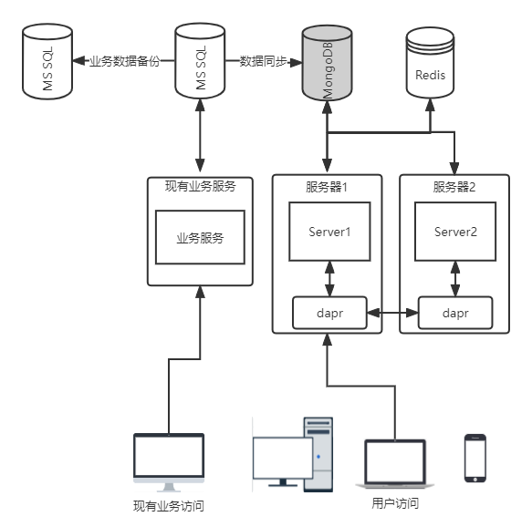
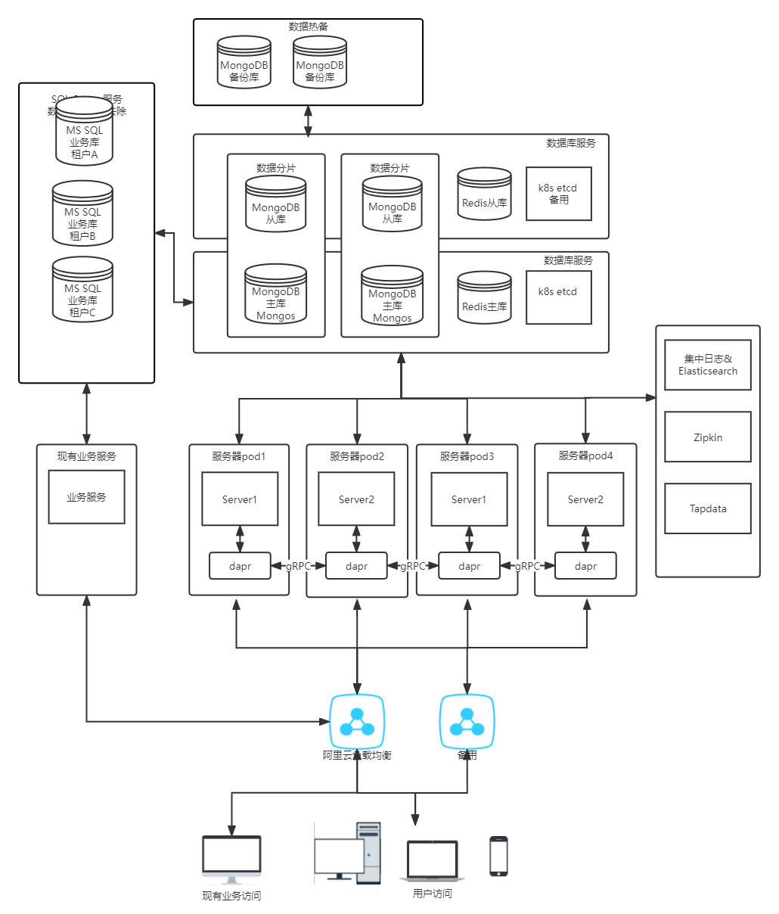
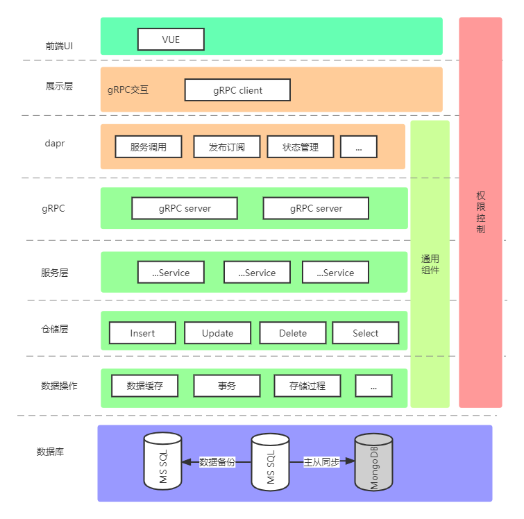

# 第一章 系统概述

## 1.1 建设背景

现有报表稳定性和性能都较差，用户体验不好。框架代码老旧，没有需求文档记录，开发效率较低，代码不规范。日益增加的需求继续一个新的报表系统和技术栈给到用户更好的体验及对开发效率的规范和效率的提升。

## 1.2 建设原则

**统一性**

​	统一的业务代码流程，统一前端控件样式，统一的数据对接服务和标准。

**规范性**  

​	规范的代码要求，健全的文档，使用符合国家标准、行业标准和公安部技术规范的协议。

**先进性**

​	将使用最新的`.Net Core6.0`和`Vue3` 构建前后端框架，在满足性能和易用性的前提下后端中间件和前端组件也将使用行业前沿技术。使用对分布式原生支持的的MongoDB4.2版本，带来更高一对多数据操作速度和更强大的聚合查询。

**线性扩展性**

​		得益于.Net 6和Vue3带来的重大改变和全新的升级，官方将会长期维护此版本，并且升级高版本也会比较平滑。MongoDB的小版本升级只需替换可执行文件即可。云原生架构，可动态扩展服务器集群。

**安全性**

​	对接入系统的设备和用户，进行严格的接入认证，以保证接入的安全性。系统将对关键数据、关键程序模块采取备份、冗余措施保证高可靠性。

**易管理性**

​	明确的架构分层，规范的代码和文档确保了代码的可维护性，降低了业务代码的编写难度。自动化的测试发布流程管理方便，减少工作量。使用`Kubernetes`管理服务器集群，提供管理平台页面。

# 第二章 需求分析

## 2.1 现状分析

**可靠性和性能问题**

1. 前后端架构整体过于陈旧
2. 数据库设计和`SQL`语句性能较低
3. 没有业务数据一致性保障
4. 业务代码漏洞较多，数据交互验证不严谨，容易奔溃
5. 报表设计为单页设计，对前后端的性能要求较高，数据过多后端处理时间过长，前端渲染容易卡死
6. 安全性较差，没有严格的数据加密和身份验证
7. 没有完善的事务和异常处理，数据原子性也无法保证
8. 没有单元测试
9. 没有关键数据的备份
10. 没有数据和服务异常检测和告警机制

**用户体验问题**

1. 前端样式过时，单一的数据表格展示，用户交互提示少，前后端数据交互不严谨，容易崩溃。
2. 操作卡顿，信息提示不全
3. 部分功能响应时间过长

**代码规范和研发效率问题**

1. 没有代码规范，注释不全。有很多产生性能问题细节代码，可维护性不高
2. 现有代码耦合性太高，没有统一的业务流程处理范式。代码实现的考虑范围仅在当前功能
3. 实现方式五花八门，小题大做的引入过多第三方包
4. 没有完善的日志功能
5. 没有文档，系统可维护性太低。
6. 整体框架过于陈旧，很多方便的新技术无法使用
7. 现有数据库多为自增主键，索引设置不合理，过多的无用字段
8. 没有自动化的系统测试和发布流程

**运维管理和效率问题**

1. 版本管理困难，手动发布更新，人工验证数据库版本
2. 租户单数据库设计，数据库过多维护更新困难
3. 部署环境不一致，部署困难，出现问题不好排查

## 2.2 目标分析

### 2.2.1 报表平台目标分析

**业务**

​	重新梳理现有逻辑业务，建立规范的业务文档。

**高性能**

​	控件调用等少量数据交互做到无明显等待感。特殊长耗时操作应该提前提醒用户，大量复杂报表查询T99控制在3m内。

**高并发**

​	分布式的系统和数据库提高系统的并发。

**高可用**

​	数据库主从配置，服务器双节点部署，业务数据热备份可恢复固定时间点。系统数据查询应该做到业务上几乎无bug。健全文档减少业务问题。服务器的性能检测和数据链路追踪，异常告警。

**数据一致性 **

​	增删改功能应该有健全的异常处理和事务制，保证核心业务数据的强一致性。

**安全性**

​	敏感数据加密和身份权限验证。

**可维护性**

​	健全代码和文档规范，规范严谨的测试发布流程和数据库管理。可视化的容器编排管理，自动化测试发布流程。

**可扩展性**

​	架构层面为web整体功能迁移提供条件。对于复杂的查询逻辑处理采用可以扩展的表达式树进行统一处理。对接第三方`Api`功能。灵活的`mongoDB`和`dapr`的分布式方案使得数据库可以灵活的横向扩展。

**兼容性**

​	不影响现有服务和数据库。使用数据实时同步兼容现有数据库表结构设计。

## 2.2 系统需求

### 2.3.1 功能需求

​	**报表系统的主要功能包括**

1.  用户管理。登录、修改个人信息、角色管理、可访问操作权限管理
2.  报表数据的查询、导出和打印功能
3.  工作台和大屏的实时数据分析和告警
4.  系统配置和数据字典设置
5.  运维可视化管理和数据检测机制

# 第三章 总体方案

## 3.1 业务系统软件

### 3.1.1 功能要求

**后端架构的设计应满足以下要求：**

1. 多租户系统设计
2. 优先满足可靠性和可维护性，可扩展性满足后续web整体功能的迁移
3. 幂等接口设计，操作前数据检查和操作后数据验证保证数据的准确性
4. 数据强一直性设计，关键实时性数据应该写到所有数据库才算成功
5. 发挥服务器性能，合理的使用并发，减少数据的处理时间
6. 选用合适的中间件，满足需求，保留一定的可扩展性，减少代码难度
7. 使用`AOP`编程统一封装核心代码，减少代码冗余和业务代码难度
8. 部分数据的高性能缓存和业务数据备份功能
9. 严格的数据和权限安全，`IP`限流等自我保护措施
10. 数据的链路追踪和异常告警机制
11. 集成式日志管理系统
12. 为运维提供自动化部署管理系统

**前端架构的设计应该满足以下要求：**

1. 标签页结构框架
2. 模块化、组件化开发，减少冗余代码提高系统可扩展性
3. 精准的包管理
4. 流畅的交互，详尽信息提示和严格的数据验证

**数据库的设计应满足以下要求：**

1. 便于今后系统功能模块的扩展
2. 提高系统的稳定性、可靠性和安全性、利于系统的维护和管理
3. 兼容现有表结构
4. 合理的索引合适，提高大量数据的查询筛选速度
5. 热备份

## 3.2 技术架构

### 3.2.1 单机部署方案

### 3.22 云端部署方案

## 3.3 报表系统方案

## 3.4 系统设计

### 3.4.1 后端设计

**.Net Core6.0 **

​	微软最新跨平台的高性能开源框架。

1. 使用`.net core6.0` `Web Api` 
2. 仅使用仓储+服务+接口的形式封装框架。
3. 使用异步开发
4. 多数据库支持，采用读写分离的方式保证报表查询的速度
5. 使用`SingalR`发送实时数据
6. `AOP`编程为项目公用模块解耦
7. 使用统的业务开发流程，使用`T4`模板减少重复工作量
8. 完善的身份认证和权限控制

**Dapr**

​	微服务编程模型平台,`saidcar`的方式提供状态管理，发布订阅，服务调用，服务观察，绑定等功能。

**Kubernetes**

​	管理容器化的工作负载和服务。使用`Rancher`提供可视化管理平台，主要提供服务自动配置和部署功能。

**Zipkin**

​	和`Dapr`集成分布式链路追踪系统。可以采集时序数据来协助定位延迟和异常等相关问题。

**Redis**

​	高性能KV数据库。数据进行缓存和有状态服务管理。

**MongoDB**

​	原生支持分布式的文档型数据库。灵活的数据结构和高性能聚合查询。最适合一对多数据结构，例如订单和订单详情。

**Tapdata**

​	国产数据同步工具。

**Elastic Stack**

​	集中式日志，使用Elasticsearch作为日志存储

### 3.4.2 前端设计

**vue3**

1. 使用`vue3`+`js`
2. 使用`axios`接口请求、`Vuex`作为数据流、`vue-router`路由、`scss`预处理样式
3. `vite`作为前端工具链
4. `UI`框架待定，备选方案有 `Vue DevUI`、`Ant Design Vue`、`ElmentUI`
5. 完善的规范的基础库封装

###  3.4.3 数据库设计

**多租户设计**

	1. namespace级别隔离，数据库和服务在单独的pod中存放，`kubernetes`和`Dapr`添加namespace访问。有特殊需求或者监管要求的租户
	1. 数据库级别隔离，单独租户单独数据库存放，对数据量较大和监管要求的租户
	1. 记录级别隔离，表内字段区分，对数据量较小的用租户

**一主多从**

1. 读写分离的一主二从的最低要求设计，保证单服务器宕机的可用性

**多租户分库**

1. 重点客户
2. 监管有数据隔离性有特殊要求的
3. 每年核心业务单表数据量会超过2000万条的

**数据分片**

1. 数据库服务器磁盘容量不超过70%或者更高。标准应在60%考虑到数据量增长缓慢。
2. 单表数据量控制在一亿条，根据时间分片

**数据备份**

1. `mongodump`全量备份+`oplog`增量，可以控制恢复到固定的时间段

2. redis、etcd和Elasticsearch仅作为和缓存和日志功能的数据存储不提供备份

   

## 3.4 功能设计

### 3.4.1 模块报表

#### 3.4.1.1 资产类报表

​	查询统计组织到科室到个人资产拥有情况。

#### 3.4.1.2 库存类报表

​	查询统计仓库内的库存数据。

#### 3.4.1.3 库存操作类报表

​	查询统计使用方，医院的收发货、报废、移库和报废等数据

#### 3.4.1.4 指定操作类报表

​	查询统计登记、投放、有效使用、灭菌、物联柜等指定操作产生的数据	

#### 3.4.1.4 结算类报表

​	查询统计使用方的资产利润结算。

#### 3.4.1.5 大屏、工作台可视化数据

​	使用折线图、柱状图、饼图 和散点图等可视化展示数据。定制数据规则，对异常数据进行告警。

## 3.5 安全方案

### 3.5.1 网络级安全

​	使用防火墙可以将不同安全级别的网络有效隔离开，通过关闭不需要的服务端口，制定有效的安全策略，在一定程度上可以有效防止黑客的攻击以及木马程序的破坏。

### 3.5.2 系统级安全

#### 3.5.2.1 更新系统补丁

​	应该对服务器操作系统和数据库服务器系统的漏洞引起足够重视，及时更新系统补丁。	

#### 3.5.2.2 安装防病毒/蠕虫/木马软件

​	运行该系统应有一个实用可行的防病毒/蠕虫/木马解决方案，这个防护体系中应该具有统一的、集中的、智能的和自动化的管理手段和管理工具，包括客户端自动化的安装、维护、配置、病毒定义码和扫描引擎的升级、定时调度、实时防护等功能。

#### 数据的安全和完整

​	使用`https`作为传输协议，隐私用户数据采用国家标准非对称加密`SM2`。使用事务数据增删改操作保证数据的原子性。关键数据的快照和备份。

### 3.5.3 应用级安全

#### 3.5.3.1 实现用户授权使用

​	任何用户都必须使用分配的账号和口令才能登录使用系统，未通过校验的用户将无法进入本系统操作。

#### 3.5.3.2 角色权限设置

​	任何用户在登录过程成功后，系统将自动分配角色权限，每个角色在系统中拥有不同操作和访问权限，相互之间不能越权访问。

#### 3.5.3.3 操作日志

​	操作过程都被记录到数据库或文件中，便于事后的跟踪、分析和统计，同时也提供了监测功能。
