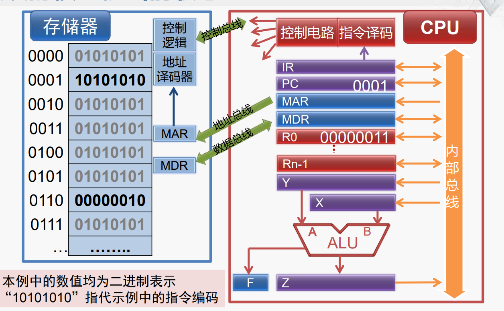

# 计算机组成

内容来自：MOOC 计算机组成 北京大学 陆俊林

## 基本结构(冯诺依曼)

### 计算机的五大组成部分

1. 运算器，CA：central arithmetical
2. 控制器，CC：central control
3. 存储器，M：memory
4. 输入设备，M：memory
5. 输出设备，O：output

### 结构的核心

运算器CA和控制器CC，在现在计算机为CPU。

存储M，在现代计算机中为主存储器（内存，主存）。

CPU包含CA和CC，通过控制总线和主存储器连接。

### 主存的组织形式

地址：每个存储单 元对应的序号。内容：存储单元中 存放的信息

### 指令执行：计算机运转的核心内容。

- 第一步：取指（Fetch）
- 第二步：译码（Decode）
- 第三步：执行（Execute）
- 第四步：回写（Write-back）

### 模型存储器

存储单元的地址是唯一 的，不同存储单元地址互不相同。

存储单元的位宽由设计计算机时对存储器的编址方法确定。如果存储器按字节编址，则每个存储单元存放8位二进制数

CPU通过控制总线和控制逻辑相连接，读写完成等控制信号

MAR：Memory Address Register 用于存放CPU正在读或写的存储单 元的地址

地址总线：CPU获取数据通过地址总线向MAR传递地址，单向传输。如果地址总线宽度为n，则CPU 能管理的存储单元最多为2 n个

数据总线：CPU和存储器的数据连接，双向连接。数据总线宽度一般为存储单元位宽的整数倍

MDR ：Memory Data Register 用于存放CPU正在读出或即将写入存储单元的数据

### 模型控制器

控制器用于控制计算机 各部件完 CPU 成取指令 、分析指令和执行指令 等功能 ，主要组成部分如下：

1. 指令寄存器 IR Instruction Register。存放正在执行或即将 行的指令
2. 程序计数器 PC Program Counter。下一条指令的存储 单元地址 ，具有自动增量 计数的功能
3. 存储器地址寄存器 MAR Memory Address Register。存放存储单元的地址
4. 存储器数据寄存器 MDR Memory Data Register。存放对存储单元读/写的数据
5. 指令译码部件。对IR中的指 令进行译码，以确定IR中 存放的是哪一条指令
6. 控制电路。控制电路产生控制信号，在 时序脉冲的同步下控制各个 部件的动作

内部总线用于在CPU内部 IR 各个部件之间传递数据。内部总线在传递数据时候只会打开传递双方对内部总线的连接，关闭其他部件的连接，以保证数据都传递到对应的部件。

### 模型运算器

- R 0~Rn - 1 是 n个通用寄存器 ，用于临时 存放数据 。数据可能来自存储器 ，也可 能来自其它通用寄存器或ALU的输出
- ALU 对 X 、 Y中的数据进行运算 ，将结果 送到 Z 。 X 、 Y 、 Z作为ALU的数据暂存 器 ，可视为ALU的一部分
- 核心部件ALU用于完成算术 运算和逻辑运算
- F用于存放运算结果的状态 （零/正负/进位/溢出）

### 计算机指令执行过程

示例：ADD R0,[6]

通用寄存器R0的内容+地址为6的存储单元的内容运算结果再写回通用寄存器R0

假设当前的状态：

#### 第一步 取指

1. 控制器将指令的地址送往存储器
2.  存储器按给定的地址读出指令内容，送回控制器

具体步骤：

1. MAR 获取PC寄存器中的指令地址。
2. CPU MAR通过地址总线发送发送地址到存储器MAR，控制总线发送读指令到存储器控制逻辑。
3. 址译码器就获取到存储器MAR中的地址，找到对应存储单元的数据。
4. 写入到存储器MDR。
5. 存储器通过MDR传输数据到CPU MDR，逻辑控制发送Ready信号到CPU控制电路。
6. CPU MDR获取数据。
7. CPU MDR通过内部总线传输数据到IR寄存器。
8. PC寄存器改为下一条指令的地址。

#### 第二部 译码

1. 控制器分析指令的操作性质
2. 控制器向有关部件发出指令所需的控制信号

####  第三步 执行

1. 控制器从通用寄存器或存储器取出操作数
2. 控制器命令运算器对操作数进行指令规定的运算

详细步骤：

1. 指令译码发送需要获取数据的地址到CPU MAR。地址为6的
2. 执行获取数据的步骤从存储器中获取数据到CPU MDR。类似于取指
3. MDR和R0寄存器发送数据到Y，X寄存器。
4. ALU开始执行运算，输出结果到Z寄存器。

#### 第四步写回

将运算结果写入通用寄存器或存储器

## 计算机指令系统

