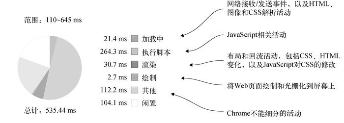
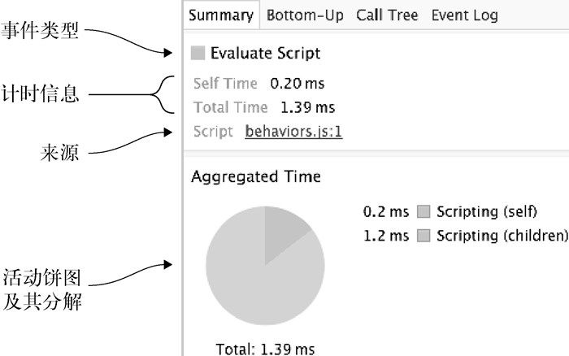
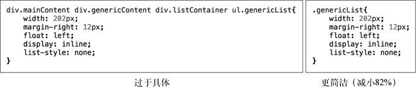
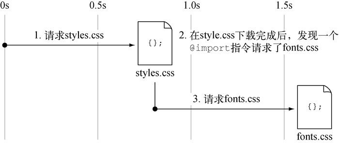

# Web 性能

### 理解 web 性能

##### 页面压缩

缩小 css

```
minify -o styles.min.css styles.css
```

缩小 js

```
minify -o jquery.min.js jquery.js
minify -o behaviors.min.js behaviors.js
```

缩小 HTML

缩小 HTMl 布局可能会发生细微的变化。这是由于空白对 CSS `display`类型（如`inline`和`inline-block`）的影响。如果对 HTML 进行缩进，这些 CSS `display`类型在周围的空格被删除后，可能会产生一些不同的行为。如果影响很大，可能需要对 CSS 进行一些调整。还要注意所有按字面处理空白的属性或标签，例如 CSS `white-space`属性或者 HTML `<pre>`标签。

```
htmlminify -o index.html index.src.html
```

##### 服务器压缩

服务器压缩的工作方式是用户从服务器请求网页。用户的请求附带一个`Accept-Encoding`头部信息，向服务器告知浏览器可以使用的压缩格式。如果服务器能够按照`Accept-Encoding`头中的指示对内容进行编码，它将用一个描述压缩方法和压缩内容的`Content-Encoding`头部信息进行回复。

然后键入如下命令以安装`compression(压缩)`模块：

```
npm install compression
```

node 服务器中导入`compression`

在微软的 Internet 信息服务（IIS）中，可以通过`inetmgr`可执行文件进入管理面板，转到特定网站，并通过实用工具的 GUI 编辑压缩设置来配置压缩

##### 压缩图像

使用`TinyPNG`服务对其进行优化

衡量图像优化的有效性

#### 理解浏览器如何渲染网页

(1) **解析 HTML 以创建 DOM（Document Object Model，文档对象模型）**——从 Web 服务器下载 HTML 时，浏览器会对其进行解析以构建 DOM，这是 HTML 文档结构的层次表示。

(2) **解析 CSS 以创建 CSSOM（CSS Object Model，CSS 对象模型）**——DOM 建立完成后，浏览器解析 CSS 并创建 CSSOM。CSSOM 与 DOM 类似，只不过它是用来表示将 CSS 规则应用于文档的方式。

(3) **布局元素**——DOM 和 CSSOM 树组合创建渲染树。然后渲染树执行布局过程，在此过程中应用 CSS 规则，并在页面上布局元素以创建 UI。

(4) **绘制页面**—— 文档完成布局过程后，页面外观将应用 CSS 和页面中的媒体内容。绘制过程结束时，输出转换为像素（光栅化）并在屏幕上显示。

### 使用评估工具

##### 使用 Google PageSpeed Insights 进行评估

##### 使用 Google Chrome 的 Performance 面板

- **加载中（蓝色）**——网络相关事件，如 HTTP 请求。它还包括诸如 HTML 解析、CSS 解析、图像解码等活动。
- **执行脚本（黄色）**——与 JavaScript 相关的事件，包括特定于 DOM 的活动、垃圾收集、特定于网站的 JavaScript、其他活动，等等。
- **渲染（紫色）**——与页面渲染相关的所有事件，包括将 CSS 应用于网页 HTML 等活动，以及会导致重新渲染的活动，例如由 JavaScript 触发的对页面 HTML 的更改。
- **绘制（绿色）**——与将布局绘制到屏幕上相关的事件，例如层合成和光栅化。





##### 识别问题事件：jank 是元凶

**jank**是指交互和动画效果卡顿，或未能顺利渲染。如果使用的编程技术欠佳，那么即使是从网络快速加载的页面，也会受到 jank 的影响。

那么，是什么导致了 jank？当单一的帧中占用了太多 CPU 时间，就会发生这种情况。**帧**是浏览器在每秒显示时间内所做的工作量。这里的**工作**指的是前面描述的事件，例如加载、脚本执行、绘制和渲染。

##### 在 Chrome 中对 JavaScript 进行基准测试

### 优化 CSS

#### 简写 CSS

使用**简写 CSS**，意味着尽可能使用最不冗长的属性和属性值。这种方法短期内不会节省很多空间，但如果在大型样式表中持续使用，累积效应会很可观。

#### 使用 CSS 浅选择器

写 CSS 时，浅显是一种优点。此处说的“浅显”，指的是 CSS 选择器的具体性。过于具体的选择器层次很深，而较浅的选择器则只指定匹配元素所需的内容。

在大型样式表中，保持 CSS 选择器简洁可以节省空间。通过降低复杂度，可以使样式表保持简洁并缩短加载时间，从而提高页面性能



#### LESS 和 SASS 预编译器：简单就是美

CSS 预编译器在前端开发人员的工具包中占据重要地位。预编译器提供了纯 CSS 中不可用的特性，包括变量、用于重用样式的函数（称为`mixin`）和帮助 CSS 模块化的导入功能。这些工具将用预编译语言编写的文件编译成浏览器可以理解的纯 CSS。流行的预编译器有 LESS 和 SASS。

编译后，原始 LESS/SASS 代码中的嵌套使 CSS 选择器过于具体。在这种情况下，`#main`的**每个**子节点现在都太具体了。嵌套越深，问题越大。压缩和缩小确实在一定程度上缓解了这种情况，但这些过于具体的选择器也会延长渲染时间。要尽可能少用这个功能，因为看不到的东西会伤害你。

#### 不要重的选择器

前端开发人员在 CSS 中遇到的另一个问题是，选择器之间的属性经常重复。例如，多个选择器指定相同的背景色或字体样式。可以通过最小化属性声明的次数，减少代码膨胀，并使 CSS 更易于维护。

#### 使用`csscss`查找冗余

```
//使用gem安装 需要ruby
gem install csscss
csscss styles.css -v --no-match-shorthand
```

#### 分割 CSS

一次加载改成分开加载多个 css，按需求加载

#### 对 CSS 进行性能调整

##### 避免使用`@import`声明

你可能见过`@import`指令在 CSS 中的使用。应该避免这种做法，因为`@import`指令与`<link>`标签不同，在下载整个样式表之前，不会处理样式表中的`@import`指令。这种行为会导致网页的总加载时间延迟。

##### `@import`串行请求

面向性能的网站的目标之一是尽可能多地并行化 HTTP 请求。**并行请求**是在同一时间（或接近同一时间）发出的请求。

**串行请求**则相反，一个接一个地发生。在外部 CSS 文件中使用时，



### Javascript 优化

#### 影响脚本加载行为

**浏览器自上而下读取 HTML 文档。找到外部资源链接时（例如本例中的脚本），浏览器将停止读取 HTML 并开始解析。解析过程会阻塞渲染，请将 js 文件放置在结尾处**

#### 使用异步脚本加载

**使用与不使用`async`属性加载脚本的比较。主要区别在于：使用 async 加载的脚本不会等待其他脚本加载完成后再执行**

```
<script src="js/jquery.min.js" async></script>
<script src="js/behaviors.js" async></script>
```

**`async`属性会导致 behaviors.js 报错，因为它在依赖项 jquery.min.js 可用之前执行**

解决此问题的一种方法是将依赖脚本组合起来，以便将这些依赖打包为单个资源。在本例中，可以按顺序组合 jquery.min.js 和 behaviors.js。在命令行中运行此命令，将两个脚本合并为 scripts.js：

```
unix系统：
cat jquery.min.js behaviors.js > scripts.js
```

```
windows系统
type jquery.min.js behaviors.js > scripts.js
```

```
改为使用一个标签
<script src="js/scripts.js" async></script>
```

#### 在多脚本加载中可靠地使用`async`

将使用名为 Alameda 的模块加载程序

**什么是 AMD 模块？**

AMD 代表异步模块定义。此规范将脚本定义为模块，并提供了一种机制，用于根据彼此之间的依赖关系异步加载脚本。

> **代码清单 8-1**　配置 Alameda 并将 behaviors.js 定义为 AMD 模块

```
requirejs.config({      <----开始Alameda配置
    paths:{      <----定义依赖
        jquery: "jquery.min"      <----jQuery脚本相对于behaviors.js的位置
    }
});      <----Alameda配置结束

require(["jquery"], function($){      <----AMD模块定义
    /* 简短起见，此处省略behaviors.js的内容 */      <----在模块定义中包含behaviors.js的内容
});
```

从 index.html 中删除所有`<script>`标签，并在结束标签之前添加以下`<script>`：

```
<script src="js/alameda.min.js" data-main="js/behaviors" async></script>
```

- `src`加载 Alameda 脚本。
- `data-main`引入 behaviors.js 脚本。Alameda 在引用脚本时不需要.js 后缀，这是 AMD 模块的语法。
- `async`异步加载 Alameda，防止阻塞页面渲染。

我们在此要做两件事：定义一个配置，告诉 Alameda jquery.min.js 所在的位置，然后将 behaviors.js 脚本包装在一个模块定义中，该模块定义在第一个参数中将 jQuery 指定为依赖项。然后，第二个参数中的依赖代码在满足其依赖关系时运行。

#### 使用更简洁的兼容 jQuery 的替代方案

####　使用更简洁的兼容 jQuery 的替代方案

多年前，jQuery 突然出现，当时，要完成一些简单的任务，比如选择 DOM 元素和绑定事件，需要复杂的代码来检查不同浏览器上可用的方法。很少有方法是统一的，而 jQuery 利用了这一点，提供了一致的 API，使得用户可以不在意浏览器类型。

可以理解，jQuery 由于其实用性和方便的语法而持续存在。但是基于很多理由，你可以考虑使用与 jQuery 共享 API 部分的替代方案，同时可以享受更小的占用空间和更高的性能。

本节将介绍 jQuery 的替代方案。我们将比较它们的大小和性能，并在科伊尔家电维修网站上选择其中一个选项。此外还会介绍这些替代方案的注意事项。

比较替代方案

许多 JavaScript 库都与 jQuery 兼容。在这些备选方案中，**与 jQuery 兼容**并不意味着提供了每个 jQuery 方法，而是意味着 jQuery 中的许多方法在备选方案中可用，并且语法相同。其目的是用文件大小的度量来换取更少的功能。其中一些库还提供了更好的性能。

探索竞品

我们将比较三个兼容 jQuery 的库：Zepto、Shoestring 和 Sprint，它们各自的详细信息如下。

- Zepto 被描述为一个轻量级的兼容 jQuery 的 JavaScript 库。在所有 jQuery 备选方案中，它是最富开箱即用特性的，并且可以扩展以完成更多工作。它是这个领域最受欢迎的选择。
- Shoestring 是由 Filament Group 编写的。它提供的功能比 Zepto 少，但提供了 jQuery 提供的大多数核心 DOM 遍历和操作方法，对`$.ajax`方法的支持有限。
- Sprint 是最轻量、功能最简单的 jQuery 替代品，但其性能很高。虽然它提供的功能并没有那么多，但是当你想从很少的功能开始时，它很适合，并且在需要时可以添加一个更为强大的库。

> 性能比较

大部分情况下 sprint 最好，Zepto 最次(和 jquery 差不多)。

Sprint 似乎是速度最快的，但值得注意的是，Sprint 的 API 与 jQuery 的 API 并不完全兼容。Zepto 覆盖了大多数 jQuery 方法，并且有插件来进一步扩展其功能。尽管 Sprint 在性能方面看起来很有吸引力，但它并不是改造以 jQuery 为中心的 Web 项目的最简单的替代方案。

虽然 Zepto 不是性能最高的备选库，但它支持你需要的所有功能，而且比 jQuery 的 1/3 还小。你可以轻松地将网站的负载从 122 KB 降到 102 KB。

Shoestring 对`$.ajax`方法的实现与 jQuery 不完全兼容。Sprint 则因为没有$.ajax 实现，所以无法满足原有功能。

Shoestring 不支持`toggleClass`方法，但 Sprint 支持；Sprint 不支持`bind`方法，但是 Shoestring 支持。许多兼容性问题都可以通过使用变通方案或原生 JavaScript 方法来重构。

基本思想是，如果你开始开发一个新的网站时考虑的是 jQuery，那么应该从一个最简单的库开始，比如 Sprint。

#### 使用更简洁的兼容 jQuery 的替代方案

多年前，jQuery 突然出现，当时，要完成一些简单的任务，比如选择 DOM 元素和绑定事件，需要复杂的代码来检查不同浏览器上可用的方法。很少有方法是统一的，而 jQuery 利用了这一点，提供了一致的 API，使得用户可以不在意浏览器类型。

可以理解，jQuery 由于其实用性和方便的语法而持续存在。但是基于很多理由，你可以考虑使用与 jQuery 共享 API 部分的替代方案，同时可以享受更小的占用空间和更高的性能。

本节将介绍 jQuery 的替代方案。我们将比较它们的大小和性能，并在科伊尔家电维修网站上选择其中一个选项。此外还会介绍这些替代方案的注意事项。

####　比较替代方案

许多 JavaScript 库都与 jQuery 兼容。在这些备选方案中，**与 jQuery 兼容**并不意味着提供了每个 jQuery 方法，而是意味着 jQuery 中的许多方法在备选方案中可用，并且语法相同。其目的是用文件大小的度量来换取更少的功能。其中一些库还提供了更好的性能。

####　探索竞品

我们将比较三个兼容 jQuery 的库：Zepto、Shoestring 和 Sprint，它们各自的详细信息如下。

- Zepto 被描述为一个轻量级的兼容 jQuery 的 JavaScript 库。在所有 jQuery 备选方案中，它是最富开箱即用特性的，并且可以扩展以完成更多工作。它是这个领域最受欢迎的选择。
- Shoestring 是由 Filament Group 编写的。它提供的功能比 Zepto 少，但提供了 jQuery 提供的大多数核心 DOM 遍历和操作方法，对`$.ajax`方法的支持有限。
- Sprint 是最轻量、功能最简单的 jQuery 替代品，但其性能很高。虽然它提供的功能并没有那么多，但是当你想从很少的功能开始时，它很适合，并且在需要时可以添加一个更为强大的库。

Sprint 的性能最好，zepto 最差(和 jquery 差不多)

Sprint 的 API 与 jQuery 的 API 并不完全兼容。Zepto 覆盖了大多数 jQuery 方法，并且有插件来进一步扩展其功能

虽然 Zepto 不是性能最高的备选库，但它支持你需要的所有功能，而且比 jQuery 的 1/3 还小。你可以轻松地将网站的负载从 122 KB 降到 102 KB。

而 Shoestring 对`$.ajax`方法的实现与 jQuery 不完全兼容。Sprint 则因为没有$.ajax 实现，所以无法满足原有功能。

**基本思想是，如果你开始开发一个新的网站时考虑的是 jQuery，那么应该从一个最简单的库开始，比如 Sprint。如果一开始就采用极简主义，就可以确保尽可能保持简洁。这种心态有助于为用户提供更快的网站。这不仅适用于 jQuery，也适用于 Web 开发的所有方面。我们应当始终扪心自问：“我需要在这个网站中使用新库吗？”这很可能会引导你走上一条不同于最初预期的道路。**

#### 脱离 jQuery 编码

使用 js 编码

Fetch API 请求数据，如果浏览器不支持 Fetch API

- 可以不使用`fetch`，并使用 jQuery 的`$.ajax` API 的独立实现。
- 可以在`window`对象中探查`fetch`方法。如果找到方法，就可以使用`fetch`，否则，可以使用标准的`XMLHttpRequest`对象。或者不管怎样都使用`XMLHttpRequest`对象，因为它的支持度很好（尽管使用起来很痛苦）。
- 可以探查`fetch`方法，如果找不到，则异步加载 polyfill。

#### 使用`requestAnimationFrame`设置动画

使用计时器函数设置动画（`setTimeout`）

```javascript
function draw(){
    document.querySelector(".item").style.width =      （本行及以下1行）以2像素作为间隔修改元素的left属性
        (parseInt(document.style.width) + 2)) + "px";
    setTimeout(draw, 1000 / 60);      <----以60帧的速率递归运行draw函数
}

draw();      <----初始函数调用，触发draw函数
```

使用`requestAnimationFrame`设置动画

```javascript
function draw(){
    document.querySelector(".item").style.width =
        (parseInt(document.style.width) + 2)) + "px";
    requestAnimationFrame(draw);      <----运行特定函数，但未指定间隔
}

draw();
```

##### 比较性能


```
你告诉animate选择.modal元素，并在500毫秒的时间内将其top属性的动画从-150%设置为10%。
function animate(selector, duration, property, from, to, units){
    var element = document.querySelector(selector),      <----从DOM中选择元素，并保存到变量
        endTime = Number(new Date()) + duration,      <----计算动画的结束时间
        interval = (1000 / 60),      <----效果的间隔，以60帧速率计算
        progress = function(){      <----绘制动画
            var progress = Math.abs(((endTime - +new Date()) / duration) - 1);
            return (progress * (to - from)) + from;
        },
        draw = function(){      <----检查效果的持续时间是否已过期
            if(endTime > +new Date()){      <----递增动画并递归调用draw函数
                element.style[property] = progress() + units;      （本行及以下1行）如果持续时间已过，则将元素设置为最终位置
                function animate(selector, duration, property, from, to, units){
    var element = document.querySelector(selector),      <----从DOM中选择元素，并保存到变量
        endTime = Number(new Date()) + duration,      <----计算动画的结束时间
        interval = (1000 / 60),      <----效果的间隔，以60帧速率计算
        progress = function(){      <----绘制动画
            var progress = Math.abs(((endTime - +new Date()) / duration) - 1);
            return (progress * (to - from)) + from;
        },
        draw = function(){      <----检查效果的持续时间是否已过期
            if(endTime > +new Date()){      <----递增动画并递归调用draw函数
                element.style[property] = progress() + units;      （本行及以下1行）如果持续时间已过，则将元素设置为最终位置
```

使用`requestAnimationFrame`代替`setTimeout`

```
draw = function(){
    if(endTime > +new Date()){
        element.style[property] = progress() + units;
        requestAnimationFrame(draw);
    }
    else{
        element.style[property] = to + units;
        return;
    }
};
```

requestAnimationFrame`并未受到普遍支持，那么可以做什么来确保更好的支持呢？首先，可以创建一个占位符，以便优先使用`requestAnimationFrame`，当它不存在时回退到`setTimeout

```
window.raf = (function(){      <----定义回退方法
    return window.requestAnimationFrame || function(callback){      <----返回最先可用的方法
        var interval = 1000 / 60;      <----以60帧速率计算间隔
        window.setTimeout(callback, interval);      <----如果依赖setTimeout，则设置回调和间隔
    };
})();
```

#### Velocity.js

Velocity.js 是一个动画库，它使用的 API 类似于 jQuery 的`animate`方法。Velocity 最好的一点是它独立于 jQuery。

### 使用 Service Worker 提升性能

#### 何为 Service Worker

**Service Worker**是 Worker 的一种——Worker 是在不同于普通脚本的特殊范围内运行的脚本的一种标准，并且这种标准还在不断发展中。Worker 在单独的处理线程上执行任务，而不是用使用`<script>`标签编写和引用的典型 JavaScript 代码.

因为 Service Worker 在单独的线程上操作，所以它的行为与通过`<script>`标签加载的 JavaScript 不同。Service Worker 无法直接访问父页面上的`window`对象。尽管它也可以与父页面通信，但必须通过中介（如`postMessage` API）间接地进行。


